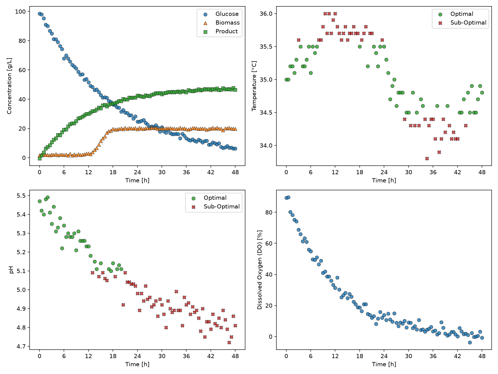

# Fermentation Batch Monitor

A Python tool that turns raw fermentation batch data into operating-range dashboards and batch summary tables.

## Overview
Fermentation outcomes depend on keeping variables such as pH and temperature within acceptable limits. The goal of this project was to automate batch extraction from a fermentation dataset, flag measurements that fall outside acceptable operating ranges, and generate dashboards and summary tables for different operating modes.

## Features
The custom `BioprocessMonitor` class:
- Loads a fermentation dataset and extracts individual batches
- Flags pH and temperature measurements as optimal or sub-optimal based on configurable limits
- Exports a 2×2 dashboard for each batch showing concentrations, temperature, pH and dissolved oxygen
- Exports a summary table with the percentage of optimal pH and temperature measurements and the final product concentration for each batch

## Technologies Used
- Python 3.13.15
- pandas 3.0.6
- matplotlib 3.11.2

## Code Design
Running `main.py` loops over two operating modes, each with its own pH and temperature limits (Mode A: pH 4.8–5.6, 34.0–36.0 °C; Mode B: pH 5.1–5.5, 34.5–35.5 °C). For every batch it saves a dashboard PNG to `figures/`, then saves one summary CSV per mode to `tables/`. The `BioprocessMonitor` class lives in `src/classes.py`.

## Dashboard

This dashboard shows Batch 1 under the stricter Mode B limits. The top-left panel shows glucose being consumed while biomass and product concentrations rise, with product levelling off at roughly 46 to 48 g/L. The top-right and bottom-left panels show temperature and pH, with green circles for measurements within limits and red X's for measurements outside them. Temperature drifts out of range between about 30 and 42 h, and pH falls below the lower limit after about 12 h. The bottom-right panel shows dissolved oxygen dropping steadily as the culture consumes oxygen.

## Summary Table
| batch_id | ph_optimal_percent | temperature_optimal_percent | C_product_g_L^-1_final |
|----------|--------------------|-----------------------------|------------------------|
| 1        | 93.81              | 97.94                       | 46.5                   |
| 2        | 96.69              | 97.52                       | 50.8                   |
| 3        | 95.89              | 93.15                       | 44.6                   |
| 4        | 100.0              | 96.47                       | 48.6                   |
| 5        | 48.62              | 99.08                       | 24.7                   |

This table summarizes each batch under the Mode A limits (pH 4.8–5.6, 34.0–36.0 °C). `ph_optimal_percent` and `temperature_optimal_percent` give the percentage of measurements that stayed within the acceptable pH and temperature ranges, and `C_product_g_L^-1_final` is the product concentration at the end of the batch. Batches 1 to 4 kept pH and temperature in range for over 93% of measurements and reached final product concentrations of 44.6 to 50.8 g/L. Batch 5 is the outlier: only 48.62% of its pH measurements were in range, and it finished at 24.7 g/L, about half the yield of the other batches, which suggests poor pH control hurt productivity.